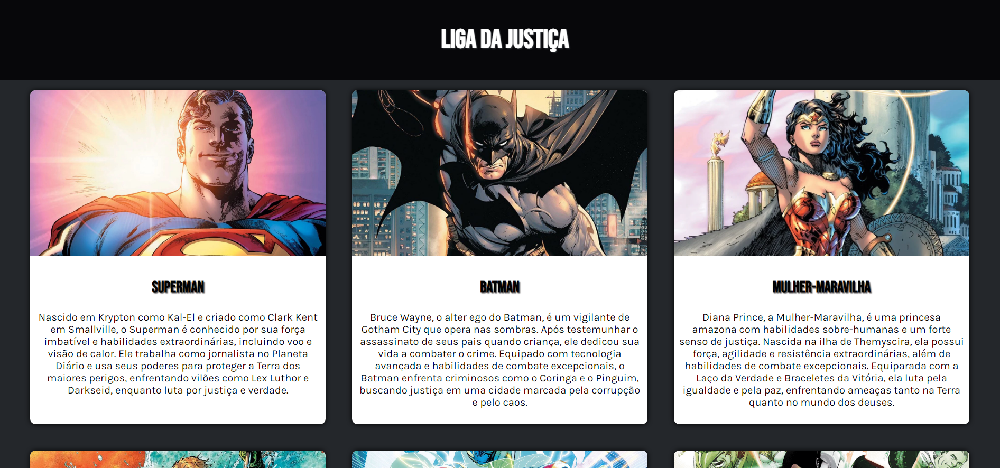

# Liga da Justiça - Site de Apresentação (Usando HTML e CSS)

Este é um projeto de um site desenvolvido para apresentar informações sobre os membros fundadores da Liga da Justiça. O objetivo principal é demonstrar habilidades em HTML e CSS.

## Descrição

O site foi criado para fornecer uma visão geral dos heróis da Liga da Justiça, destacando suas características e habilidades em uma interface visualmente atraente. Cada herói tem um card dedicado que inclui uma imagem e uma breve descrição.

## Estrutura do Projeto

- **`index.html`**: Página principal do site contendo todos os cards dos heróis e a estrutura do conteúdo.
- **`styles.css`**: Folha de estilo CSS para a formatação e o layout da página.

## Heróis Apresentados

O site inclui informações sobre os seguintes membros da Liga da Justiça:
1. Superman
2. Batman
3. Mulher-Maravilha
4. Aquaman
5. Flash
6. Cyborg

## Exucução

Pode acessar pelo vercel:
https://liga-da-justica-site.vercel.app/

